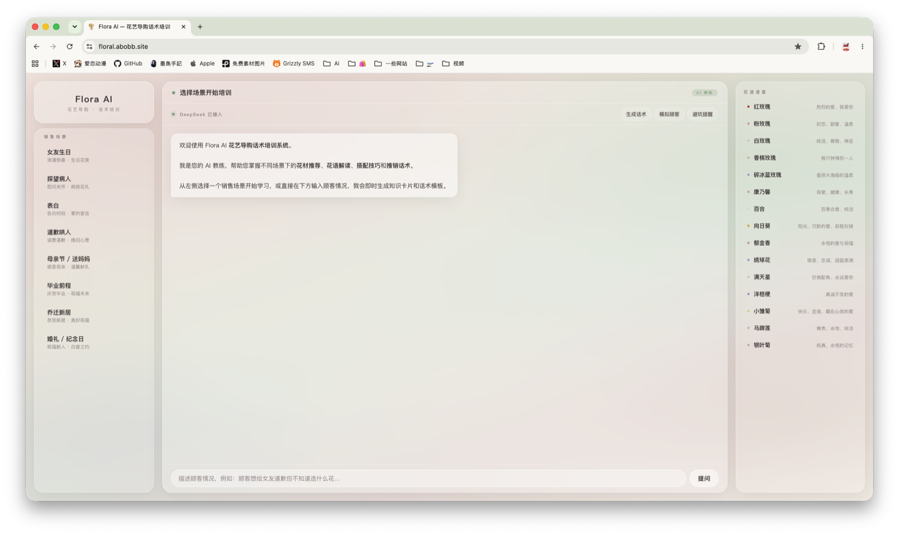

# Flora AI



Flora AI 是一个面向花店导购的 AI 话术培训工作台。它把常见花礼销售场景、花材推荐、花语解释、搭配逻辑、避坑提醒和导购话术整合到一个可直接使用的前端应用里，帮助新导购更快掌握“该推荐什么、为什么推荐、应该怎么说”。

项目采用轻量架构：单页前端负责训练界面和场景知识库，Vercel Serverless Function 负责代理 DeepSeek API 请求，避免将 API Key 暴露到浏览器端。

## 在线体验

- 生产环境：<https://floral-sales-consultant.vercel.app>
- 前端形态：原生 HTML / CSS / JavaScript 单页应用
- 后端形态：Vercel Serverless Function
- AI 模型：DeepSeek Chat API

## 核心功能

- 场景化花艺导购训练
- 花材推荐、花语说明、花束搭配方案
- 针对价格异议、犹豫、紧急送达等情况的话术模板
- AI 教练模式，支持用户自由描述顾客需求
- 花语速查面板
- 桌面端与移动端响应式布局
- AI 请求失败时保留本地规则兜底回复

## 产品需求文档（PRD）

### 1. 产品概述

Flora AI 是一个为花店销售人员设计的训练型应用。产品目标不是替代门店经营系统，而是把导购经验结构化，让新员工或兼职导购可以在短时间内掌握不同送花场景下的推荐逻辑、表达方式和禁忌事项。

当前版本重点解决“销售培训”和“即时话术支持”两个问题，不包含下单、支付、库存、会员、CRM 等门店经营模块。

### 2. 背景与问题

花艺销售高度依赖场景判断。顾客买花的原因可能是生日、表白、道歉、探病、母亲节、毕业、乔迁、婚礼等。不同场景下，推荐花材、颜色、包装、价格引导和表达方式都不一样。

新导购常见问题包括：

- 知道花材名称，但不知道如何匹配顾客真实意图。
- 会推荐产品，但不会把花语讲得有说服力。
- 面对顾客嫌贵、犹豫、不懂花时缺少话术。
- 不熟悉某些场景下的文化禁忌和表达边界。
- 难以把专业知识转化成自然、可成交的销售语言。

Flora AI 通过固定场景知识库加 AI 教练，把导购经验拆成可学习、可练习、可复用的模块。

### 3. 目标用户

主要用户：

- 花店新导购
- 门店兼职销售人员
- 需要统一培训口径的花店店主
- 负责话术培训的门店主管

次要用户：

- 花艺课程老师
- 小红书、微信、私域等渠道的花礼销售者
- 需要准备节日销售话术的小型花艺工作室

### 4. 产品目标

- 降低花艺导购培训成本。
- 提升新导购对常见送花场景的判断能力。
- 让导购快速生成可直接对顾客说的话术。
- 帮助门店统一推荐逻辑、禁忌提醒和服务表达。
- 在不暴露 API Key 的前提下接入 AI 能力。

### 5. 非目标范围

当前版本不解决以下问题：

- 在线下单、购物车、支付与配送。
- 门店库存和价格管理。
- 用户登录、会员体系和 CRM。
- 花材养护知识库的完整管理。
- 医疗、心理疗愈等功效性承诺。
- 不同地区习俗差异的自动判断。

### 6. 核心用户故事

- 作为新导购，我希望选择一个销售场景，快速学习该场景适合推荐哪些花。
- 作为导购，我希望输入顾客的自然语言需求，让 AI 帮我判断场景并生成话术。
- 作为店主，我希望员工看到统一的推荐理由、搭配方案和避坑提醒。
- 作为销售人员，我希望快速查询花语，避免在顾客面前临时搜索。
- 作为移动端用户，我希望在手机上也能顺畅使用训练流程。

### 7. 功能需求

#### 7.1 场景训练

- 系统内置多个常见销售场景。
- 用户可以在桌面端侧边栏或移动端横向场景栏选择场景。
- 选择场景后展示：
  - 场景概览
  - 推荐花材
  - 花语解释
  - 推荐理由
  - 搭配方案
  - 推销话术
  - 推荐做法
  - 需要避免的事项

#### 7.2 AI 教练

- 用户可以输入任意顾客需求描述。
- 前端会把用户输入、当前场景、场景库和花语库发送到 `/api/chat`。
- `/api/chat` 由服务端读取 `DEEPSEEK_API_KEY` 并请求 DeepSeek。
- AI 输出应优先包含：
  - 场景判断
  - 推荐花材
  - 顾客话术
  - 追问问题
  - 避坑提醒
- AI 请求失败时，前端使用本地规则回复，确保训练不中断。

#### 7.3 花语速查

- 右侧面板展示常用花材与花语。
- 点击花材后自动向 AI 或本地规则询问花语与搭配建议。
- 移动端通过底部标签切换到花语速查。

#### 7.4 响应式体验

- 桌面端采用三栏结构：
  - 左侧：销售场景
  - 中间：AI 对话训练
  - 右侧：花语速查
- 移动端采用：
  - 顶部品牌标题
  - 横向场景选择
  - 内容区
  - 底部标签导航

#### 7.5 安全要求

- 前端不得出现真实 API Key。
- `.env` 不进入 Git 仓库。
- GitHub 仓库只保留 `.env.example` 占位示例。
- AI 请求必须通过服务端代理完成。

### 8. 体验要求

- 首屏直接进入工作台，不做营销落地页。
- 视觉风格应贴合花艺场景：柔和、温暖、轻盈，但不影响信息阅读。
- 场景列表要便于快速扫描。
- 对话区要突出“训练”和“可复制话术”。
- 卡片内容要有清晰层级，避免堆砌。
- 移动端不应出现横向滚动或文字挤压。

### 9. 内容要求

每个销售场景至少包含：

- 场景名称
- 场景简介
- 标签
- 顾客需求示例
- 推荐花材
- 花语
- 推荐理由
- 搭配方案
- 话术模板
- 推荐做法
- 避坑提醒

AI 生成内容应满足：

- 使用中文。
- 具体、简洁、可直接用于销售对话。
- 不编造医疗功效。
- 不输出冒犯习俗或关系边界的建议。
- 不用空泛鸡汤替代实际推荐。

### 10. 技术方案

前端：

- `index.html` 承载完整 UI、场景数据和交互逻辑。
- 使用原生 HTML、CSS、JavaScript。
- 不依赖前端构建步骤。

本地开发：

- `dev-server.js` 提供本地静态服务。
- 本地 `/api/chat` 与线上接口保持一致。
- 通过 `.env` 读取 DeepSeek 配置。

生产环境：

- `api/chat.js` 是 Vercel Serverless Function。
- `vercel.json` 显式配置静态资源和 API 路由。
- `DEEPSEEK_API_KEY` 和 `DEEPSEEK_MODEL` 配置在 Vercel 环境变量中。

### 11. 成功指标

产品体验：

- 新用户能在 10 秒内理解入口并选择一个训练场景。
- 导购能在一次 AI 回复内获得可用销售话术。
- 桌面端和移动端均无明显布局溢出。

训练效果：

- 新导购能更快说清楚“为什么推荐这束花”。
- 员工对禁忌花材和敏感场景的错误率降低。
- 门店销售话术更加统一。

技术健康：

- 生产首页返回 HTTP 200。
- `/api/chat` 在环境变量配置正确时返回有效回复。
- favicon 和静态资源正常加载。
- README、Markdown 和拼写检查通过。

### 12. 风险与应对

- 风险：AI 可能给出不准确或不合适的建议。
  - 应对：保留人工整理的场景知识库，并在系统提示词中加入边界约束。

- 风险：API Key 泄露。
  - 应对：只在服务端读取环境变量，仓库忽略 `.env`。

- 风险：不同门店价格和库存不同。
  - 应对：当前内容定位为培训建议，不作为实时库存和报价系统。

- 风险：页面信息密度过高。
  - 应对：用场景导航、对话区、速查区拆分任务。

### 13. 当前版本范围

已实现：

- 单页训练界面
- 8 个常见花艺销售场景
- 花语速查
- DeepSeek AI 教练
- 本地规则兜底
- 桌面端与移动端适配
- Vercel 部署

后续可扩展：

- 门店自定义花材库
- 价格区间和库存配置
- 训练评分
- 对话记录导出
- 节日专题话术包
- 多门店员工培训进度
- 后台场景编辑器

## 架构说明

```text
浏览器
  |
  | 静态页面、场景数据、用户输入
  v
index.html
  |
  | POST /api/chat
  v
Vercel Serverless Function: api/chat.js
  |
  | DeepSeek Chat Completions API
  v
AI 导购教练回复
```

本地开发时，`dev-server.js` 会提供静态页面服务，并以同样的接口形态代理 `/api/chat`。

## 项目结构

```text
.
├── api/chat.js                    # Vercel AI 代理接口
├── assets/favicon.png             # 浏览器 favicon
├── assets/flora-bouquet-icon-256.png
├── dev-server.js                  # 本地开发服务器
├── index.html                     # 主应用页面
├── package.json
├── vercel.json                    # Vercel 静态资源和 API 路由
└── README.md
```

## 环境变量

本地创建 `.env`：

```env
DEEPSEEK_API_KEY=your_deepseek_api_key_here
DEEPSEEK_MODEL=deepseek-chat
PORT=3000
```

Vercel 生产环境需要配置：

- `DEEPSEEK_API_KEY`
- `DEEPSEEK_MODEL`

## 本地运行

```bash
npm start
```

打开：

```text
http://localhost:3000
```

## 检查命令

```bash
node --check dev-server.js
node --check api/chat.js
npx cspell README.md
npx markdownlint-cli2 README.md
```

生产环境冒烟测试：

```bash
curl -I https://floral-sales-consultant.vercel.app/
curl -I https://floral-sales-consultant.vercel.app/assets/favicon.png
curl https://floral-sales-consultant.vercel.app/api/chat \
  -H 'Content-Type: application/json' \
  --data '{"message":"测试接口","scenes":[],"flowerRef":[]}'
```

## 部署

```bash
npx vercel --prod --yes
```

部署由 `vercel.json` 控制：

- `/` 指向 `index.html`
- `/assets/*` 指向静态资源
- `/api/chat` 指向 `api/chat.js`

## 安全说明

本仓库不包含真实 API Key。请只通过本地 `.env` 或 Vercel 环境变量配置 `DEEPSEEK_API_KEY`。

## 许可证

本项目当前未声明开源许可证。代码公开仅用于展示和协作；如需复用，请先联系作者确认授权。
